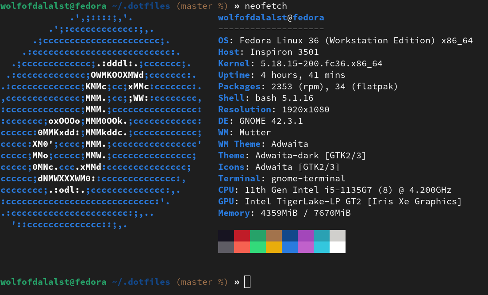

# dotfiles wolfofdalalst@fedora
Neofetch bash output; Fedora Linux 36 Inspiron 3501



## Installation
Clone this repository into ~/.dotfiles
```
# Use SSH (if set up) ...
git clone git@github.com:wolfofdalalst/dotfiles.git ~/.dotfiles

# or use HTTPS and switch remotes later.
git clone https://github.com/wolfofdalalst/dotfiles.git ~/.dotfiles
```
For installing and setting up neovim and zsh (ohmyzsh) run this command
```
sudo dnf install neovim zsh python3 code

# debian based distros
# sudo apt install neovim zsh python3 code

# rust installation script
curl --proto '=https' --tlsv1.2 -sSf https://sh.rustup.rs | sh

# ohmyzsh installation script
sh -c "$(curl -fsSL https://raw.github.com/ohmyzsh/ohmyzsh/master/tools/install.sh)"

# nvim plugin install
sh -c 'curl -fLo "${XDG_DATA_HOME:-$HOME/.local/share}"/nvim/site/autoload/plug.vim --create-dirs \
       https://raw.githubusercontent.com/junegunn/vim-plug/master/plug.vim'
nvim +PlugInstall
```

## License
This repository falls under [MIT License]().
